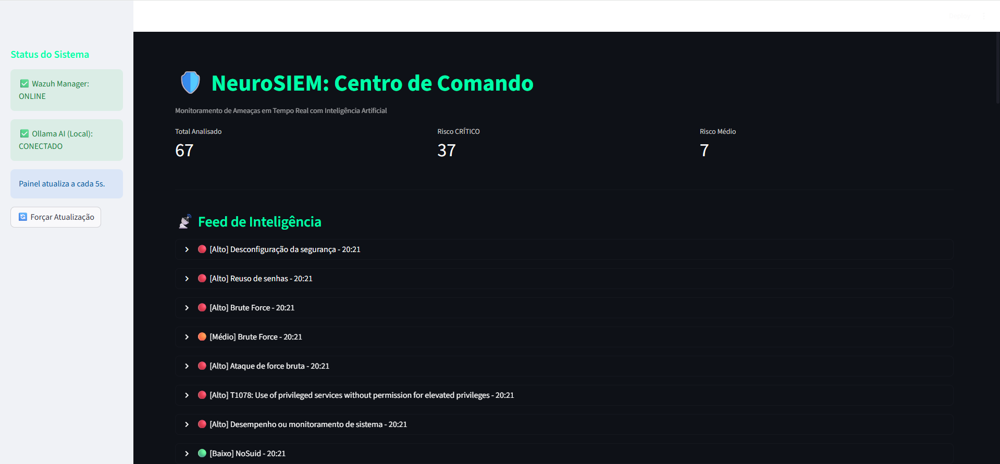

🛡️ NeuroSIEM: Automação de SOC com Inteligência Artificial Local

O NeuroSIEM é uma solução básica de Security Operations Center (SOC) de última geração que integra detecção de ameaças tradicional com análise cognitiva baseada em IA Generativa, rodando 100% localmente para garantir soberania de dados.

O sistema intercepta alertas de segurança, analisa o contexto técnico usando LLMs (Large Language Models) e gera relatórios executivos automáticos, reduzindo drasticamente o tempo de resposta a incidentes.

🧠 Arquitetura do Projeto

O projeto foi construído sobre três pilares de engenharia:

Detecção (The Body):

Wazuh SIEM (Docker): Orquestração de containers para coleta e correlação de logs em tempo real.

Custom Integration: Middleware em Python injetado no container para interceptar alertas de nível crítico.

Inteligência (The Brain):

Ollama (Local LLM): Servidor de inferência de IA rodando on-premise (utilizando GPU RTX via WSL2).

Modelos: Llama 3.2 / Mistral otimizados para análise de JSON e logs de segurança.

Privacidade: Nenhum dado sensível sai da infraestrutura para nuvens públicas (Zero Data Leakage).

Visualização (The Face):

Streamlit Dashboard: Painel de comando ("Glass Table") para monitoramento em tempo real.

Automated Reporting: Geração instantânea de PDFs com análise técnica e recomendações de mitigação.

🛠️ Tecnologias Utilizadas

Infraestrutura: Docker, Docker Compose, WSL2 (Ubuntu).

Segurança: Wazuh Manager & Indexer, Syslog.

Backend: Python 3.10, Requests, JSON processing.

Frontend: Streamlit, Pandas, Plotly.

AI/ML: Ollama, Llama 3.2.

🚀 Como Executar

Pré-requisitos

Docker Desktop instalado e rodando.

Ollama rodando localmente (ollama serve).

Python 3.9+.

Instalação

Clone o repositório:

git clone [https://github.com/Git-Dyon/NeuroSIEM.git](https://github.com/Git-Dyon/NeuroSIEM.git)
cd NeuroSIEM

Inicie a Infraestrutura (Wazuh):

cd wazuh-docker/single-node
# Ajuste obrigatório de memória para ElasticSearch/OpenSearch no WSL
sudo sysctl -w vm.max_map_count=262144
docker compose up -d

Configure a Integração:
Siga os passos no arquivo docs/MANUAL_DE_OPERACOES.md para injetar o script src/integrator.py no container e configurar o ossec.conf.

Inicie o Dashboard:

cd dashboard
pip install -r requirements.txt
streamlit run app.py

## 📸 Screenshots

### 1. Dashboard de Comando (Streamlit)
Visualização em tempo real das ameaças analisadas pela IA.

### 2. Análise Cognitiva (Logs)
O script Python interceptando o alerta e consultando o Ollama Local.

### 3. Detecção no Wazuh em JSON
O alerta JSON gerado pelo SIEM da análise.

Autor: Dionney MG
Projeto desenvolvido como laboratório avançado de DevSecOps.# NeuroSIEM
# NeuroSIEM
